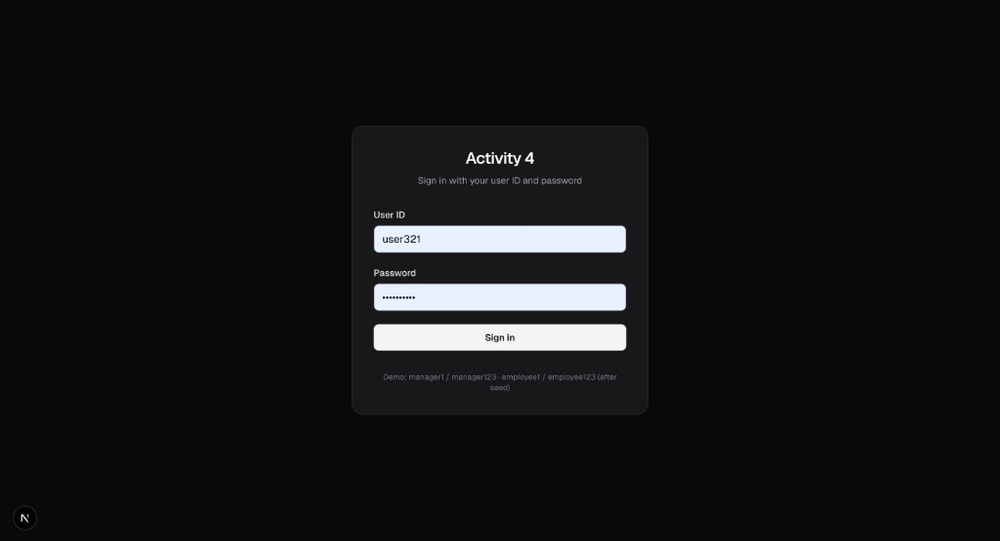
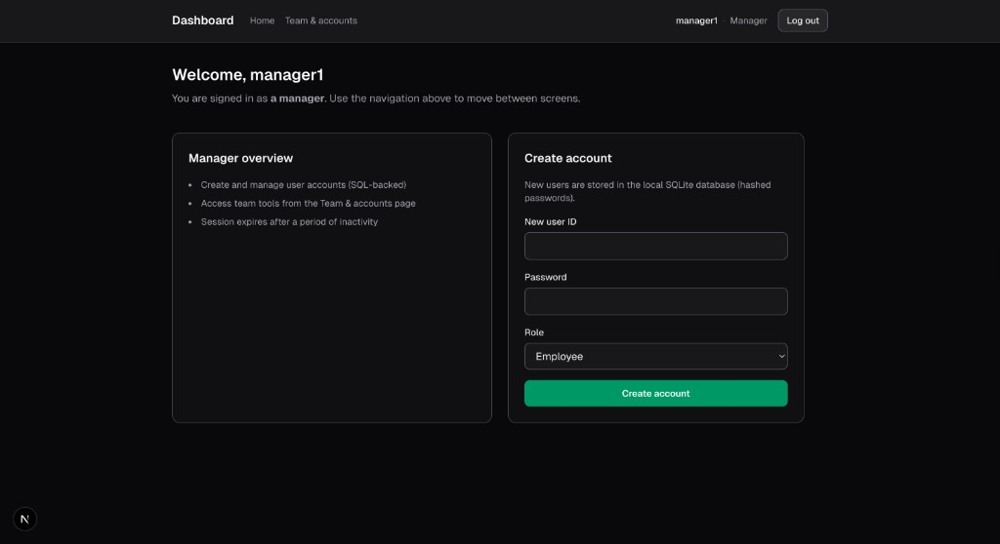
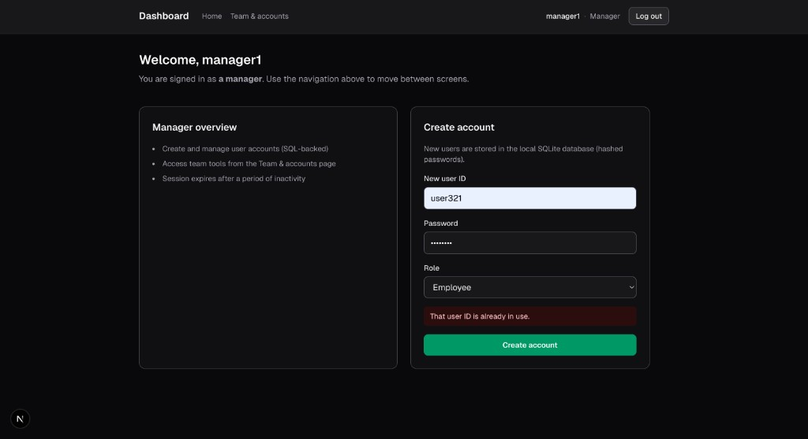
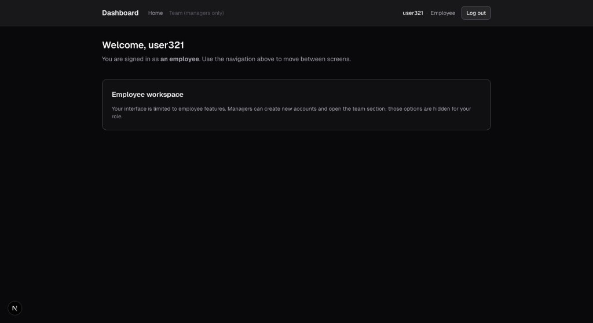
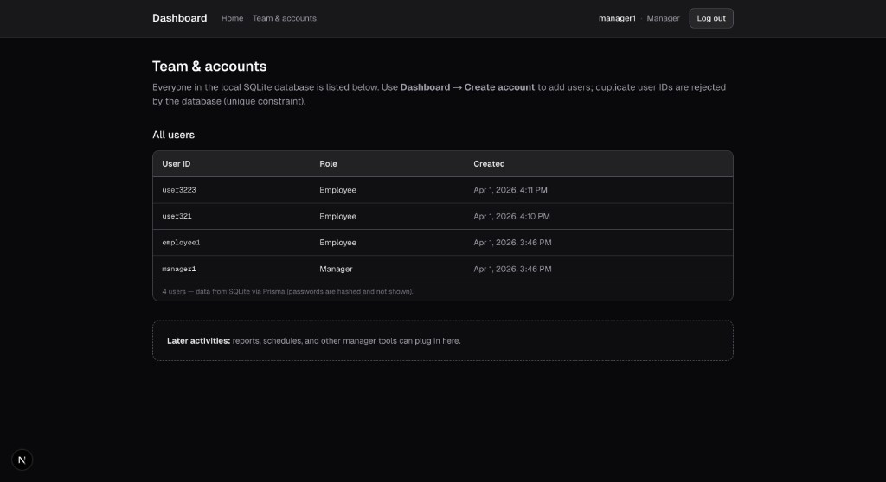

# Activity 4 — Employee Authentication GUI (Next.js + SQLite)
by Yaroslav Trach & Ryan Soroka

Web application for a course assignment: **role-based login**, **SQLite persistence via Prisma**, **manager-only account creation**, **idle session timeout**, and **remembered user IDs** on the sign-in screen. The stack follows common practice: the browser never holds database credentials; Prisma runs only on the server.

**Project Code:** [github.com/YaroslavTrachIgor/employees-sql-database-activity4](https://github.com/YaroslavTrachIgor/employees-sql-database-activity4)
**Blueprints:** [https://github.com/YaroslavTrachIgor/activity-3-store-blueprints](https://github.com/YaroslavTrachIgor/activity-3-store-blueprints)

---

## Overview

| Audience | Use this README to… |
| --- | --- |
| **Instructor / grader** | Clone, configure one environment file, install, migrate, seed, and run the dev server in a few minutes. |
| **Student / developer** | Understand features, scripts, and how the database fits the GUI. |

Static captures of the running app (local dev server) are stored in [`docs/example-images/`](docs/example-images/).

---

## Screenshots

Dark-mode UI examples from a local run:

### Login



### Manager dashboard



### Validation (duplicate user ID)



### Employee dashboard



### Team & accounts (manager only)



---

## Prerequisites

- **Node.js** 20.x or newer (LTS recommended; Next.js 16 and tooling assume a current runtime).
- **npm** (ships with Node).
- A terminal and Git.

---

## Quick start (fast path)

Run these commands in order from an empty folder (or after `git clone`).

```bash
git clone https://github.com/YaroslavTrachIgor/employees-sql-database-activity4.git
cd employees-sql-database-activity4
cp .env.example .env
```

Edit `.env`: set **`SESSION_SECRET`** to any random string of **at least 32 characters** (required for encrypted session cookies). Example:

```bash
# macOS / Linux — paste the output into SESSION_SECRET=...
openssl rand -base64 32
```

Then:

```bash
npm install
npx prisma migrate dev
npm run db:seed
npm run dev
```

Open **http://localhost:3000** — you should be redirected to the login page. Use the [demo accounts](#demo-accounts-after-seed) below to sign in.

---

## Installation (detailed)

1. **Clone** the repository (see URL above).
2. **Environment file:** copy `.env.example` to `.env`. Never commit `.env`; it is listed in `.gitignore`.
3. **Dependencies:** `npm install`
4. **Database:** `npx prisma migrate dev` creates the SQLite file and applies migrations (default path: `prisma/dev.db`).
5. **Seed data:** `npm run db:seed` inserts demo manager and employee users.

If `prisma/dev.db` is missing or corrupt, delete `prisma/dev.db` (and journal files if present) and run `npx prisma migrate dev` again, then `npm run db:seed`.

---

## Configuration

| Variable | Required | Purpose |
| --- | --- | --- |
| `DATABASE_URL` | Yes | SQLite URL. Default in `.env.example`: `file:./dev.db` (file lives under `prisma/`). |
| `SESSION_SECRET` | Yes | Minimum **32 characters**. Encrypts the session cookie (`iron-session`). |
| `NEXT_PUBLIC_IDLE_TIMEOUT_MS` | Optional | Idle logout delay in milliseconds (default `900000` = 15 minutes). |

See `.env.example` for placeholders.

---

## Usage

| Command | When to use it |
| --- | --- |
| `npm run dev` | Local development server (hot reload). Default: http://localhost:3000 |
| `npm run build` | Production build (run before `npm start`). |
| `npm start` | Serve the production build (after `npm run build`). |
| `npm run lint` | Run ESLint. |
| `npm run db:seed` | Re-apply seed users (safe for development; uses upserts in seed script). |
| `npm run db:studio` | Open **Prisma Studio** in the browser to inspect tables and rows. |

---

## Features (assignment alignment)

- Login screen on entry; protected routes via middleware and session checks.
- **Manager** vs **employee** UIs (navigation and dashboard content differ by role).
- Managers can **create accounts**; the server rejects creation if the caller is not a manager.
- **Idle timeout** logs the user out after a period of inactivity (configurable).
- **Remembered user IDs** with autocomplete on the login field (stored in the browser `localStorage`).
- **SQL integration:** registration and login use Prisma against SQLite; passwords stored as **bcrypt** hashes.

---

## Tech stack

- [Next.js](https://nextjs.org/) (App Router), React, TypeScript  
- [Tailwind CSS](https://tailwindcss.com/)  
- [Prisma](https://www.prisma.io/) + SQLite  
- [iron-session](https://github.com/vvo/iron-session) (encrypted HTTP-only session cookie)  
- [bcryptjs](https://github.com/dcodeIO/bcrypt.js) (password hashing)

---

## Demo accounts (after seed)

| Role | User ID | Password |
| --- | --- | --- |
| Manager | `manager1` | `manager123` |
| Employee | `employee1` | `employee123` |

These are for local testing only. Change or remove them in production-like deployments.

---

## Verifying the database (GUI)

Course instructions often require showing SQL work in a **GUI**. The same SQLite file the app uses can be opened in:

- **DB Browser for SQLite** or **DBeaver** (file: `prisma/dev.db` after migrations), or  
- **Prisma Studio:** `npm run db:studio`

More detail: [docs/instructor-database-gui.md](docs/instructor-database-gui.md).

---

## Project layout (high level)

```
src/app/           App Router routes (login, dashboard, team)
src/app/actions/   Server actions (auth, create user)
src/components/    Login form, idle logout, team table, etc.
src/lib/           Prisma client, session helpers
prisma/            schema.prisma, migrations, seed script
```

---

## Troubleshooting

| Issue | What to try |
| --- | --- |
| `SESSION_SECRET` errors / session not persisting | Ensure `.env` has a secret ≥ 32 characters and restart `npm run dev`. |
| Database errors after pulling changes | Run `npx prisma migrate dev` and `npm run db:seed`. |
| Port 3000 in use | `npx next dev -p 3001` or stop the other process using the port. |
| Login loop or empty session | Clear site cookies for `localhost` or use a private window. |

---

<table width="100%">
<tr>
<td align="center" style="background-color:#f6f8fa; border:1px solid #d0d7de; border-radius:8px; padding:20px 24px; color:#57606a; font-size:13px; line-height:1.5;">

**License & academic integrity**

This repository is **public** on GitHub. The code is shared for education, demonstration, and instructor review. It **must not** be used for **academically unethical** purposes—including plagiarism, unauthorized submission of this work as your own, misrepresenting authorship, or any conduct that violates your institution’s academic honesty policies. Use in graded coursework only when your instructor and school explicitly allow it, and always in compliance with their rules.

</td>
</tr>
</table>
